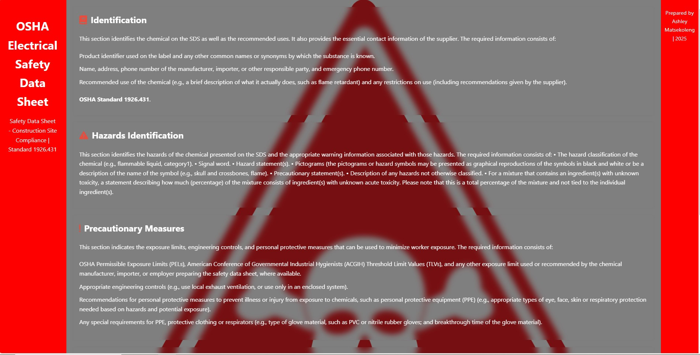

Introduction
>OSHA Electrical Safety Standard 1926.431 is a standard that relates to equipment upkeep and maintenance. This specific standard refers to the construction industry, but the recommendations work well for all job sites. 

Overview
As we'll discuss in the next section regarding electrical safety precautions, workers need to know where circuits are at all times and how to shut them off. Typically, the best way to avoid electrical injuries or fatalities is to stop the flow of power from the source. This outlines various requirements for employers, such as labelling circuits with easy-to-spot signage, warning employees before they start work in an area with a live circuit, and locating and inspecting circuits regularly.

Table of content
1. Identification
2. Hazards identification
3. Precautionary measures
4. Safe uses of Electrophores equipment
5. Regulary info

Technology stack
Front-end
- HTML
- CSS

Referring line
- salsa digital, osha.gov, google

